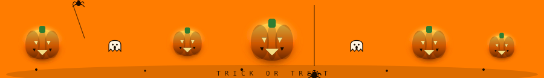
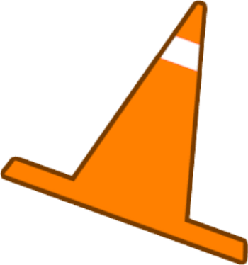
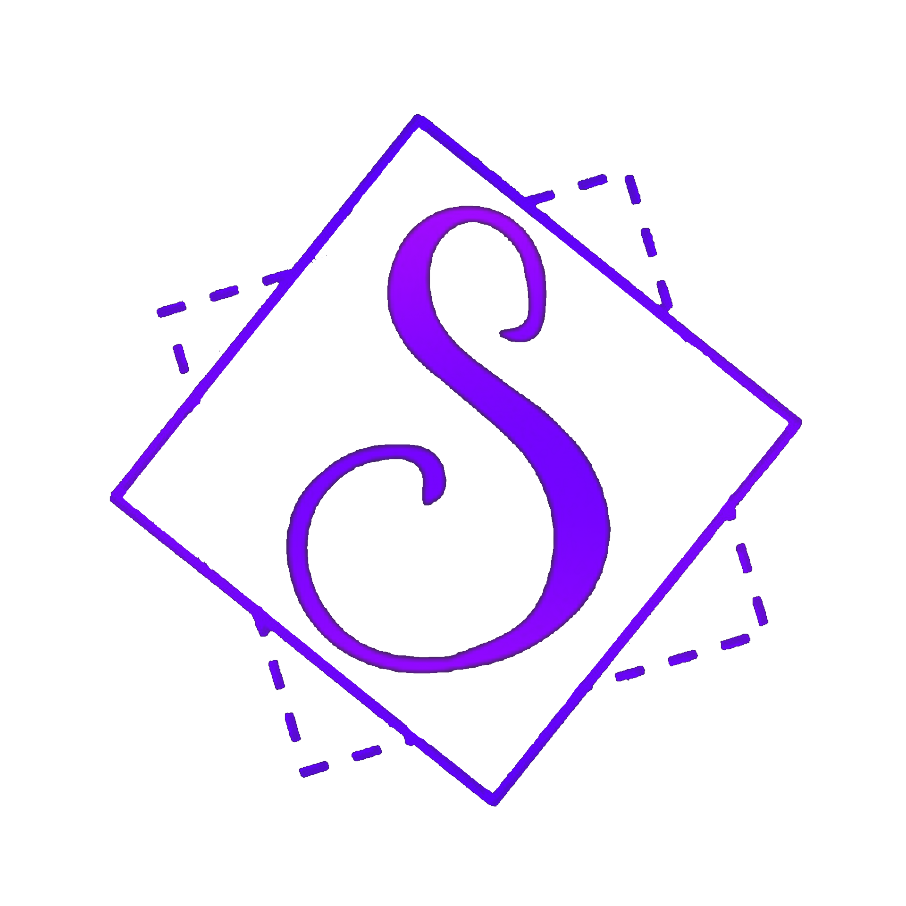
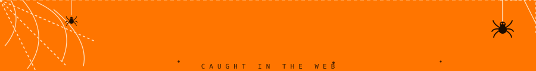

<a id="top"></a>


<p align="center">
  <a href="https://github.com/QubitManagement/Qubit-Menu">
    
  </a>
</p>


<p align="center">
  
</p>

<p align="center">
  
</p>

<div align="center">
  <h3>🎃 Community-powered. Open-source. Limitless. 👻</h3>
  <sub>🦇 HALLOWEEN 2026 &nbsp;•&nbsp; HAUNTED BUILD v5.0.2 &nbsp;•&nbsp; 570+ MODS 🕸️</sub>
</div>

<p align="center">
  
</p>

<p align="center">
  
</p>

<p align="center">
  <a href="https://github.com/QubitManagement/Qubit-Menu/releases">
    
  </a>
  <a href="https://github.com/QubitManagement/Qubit-Menu/releases/latest">
    
  </a>
  <a href="https://discord.gg/2PVfydMxyc">
    
  </a>
</p>

<p align="center">
  <a href="https://github.com/QubitManagement/Qubit-Menu/stargazers">
    
  </a>
  <a href="https://github.com/QubitManagement/Qubit-Menu/issues">
    
  </a>
  <a href="https://github.com/QubitManagement/Qubit-Menu/network/members">
    
  </a>
  
  
  
  
  
</p>

<p align="center">
  
  <br>
  <sub><b>🎃 C# • Unity • BepInEx • MelonLoader • Community Magic 🔥</b></sub>
</p>



<p align="center">
  <a href="#-about-qubit">🎃 About</a>
  •
  <a href="#-features">🦇 Features</a>
  •
  <a href="#-installation">🕸️ Installation</a>
  •
  <a href="#-compatibility">👻 Compatibility</a>
  •
  <a href="#-community">🕷️ Community</a>
  •
  <a href="#-license">📜 License</a>
</p>


## ⚡ About Qubit

*The haunted playground for Gorilla Tag modding.*

**Qubit Menu** is a community-driven mod menu for Gorilla Tag. 🎃

It is designed to provide a clean, flexible, and accessible platform for experimenting with features, customizing your experience, and contributing to the Gorilla Tag modding community.

Whether you are a player, developer, tester, or contributor, Qubit is built to give you the tools to explore and create.

> **Simple enough to use. Powerful enough to customize. Open enough to improve.**

<p align="center">
  
</p>

```text
   🎃 QUBIT v5.0.2 — HALLOWEEN BUILD 🎃
   ├── 570+ mods summoned
   ├── Modular haunted core
   ├── Custom fonts / images / sounds / videos
   ├── VR + Desktop seance supported
   └── 100% free. No paywalls. No curses.
```

<pre>
🎃 Happy Halloween from Qubit! 🎃
       .-.
      (   )
       `-'
      _.-.
    .'   '.
   /  o o  \
  |   __   |
   \ '--' /
    '.__.'
  Trick or Treat!
</pre>


## ✨ Features

*Everything in the spellbook, at a glance.*

<table>
<tr>
<td width="50%">

### 🧩 Modular 🎃

Qubit is designed around a modular feature system, making it easier to add, remove, and maintain features.

`Fun / Movement / Visuals / Important / Settings`

</td>
<td width="50%">

### 🎛️ Customizable 🦇

Customize your experience and use the features that work best for you.

Themes • Backgrounds • Fonts • Keyboard • Clock • Watermarks

</td>
</tr>

<tr>
<td width="50%">

### 🚀 Performance Focused 🕸️

Built with stability, usability, and performance in mind.

> Release build: zero errors. Clean canvas. No laggy rituals.

</td>
<td width="50%">

### 🌐 Community Driven 👻

Community feedback, suggestions, and contributions help shape Qubit's future.

Join the coven. Cast your vote. Ship your spell.

</td>
</tr>

<tr>
<td width="50%">

### 🛠️ Developer Friendly 🕷️

Open-source code makes it easier to learn, inspect, modify, and contribute.

```bash
git clone https://github.com/QubitManagement/Qubit-menu.git
```

</td>
<td width="50%">

### 🔮 Constantly Improving 🔥

Qubit continues to evolve through updates, fixes, and community contributions.

Check the [Roadmap](#️-roadmap) below. More haunts incoming.

</td>
</tr>
</table>

### 🎃 Haunted spellbook

| Spell 🕸️ | School | Effect |
|:----------|:-------|:-------|
| 🎃 Pumpkin Summon | Fun | 570+ mods rise from the patch |
| 🦇 Bat Flight | Movement | Haunted locomotion tricks |
| 👻 Ghost Vision | Visuals | ESP, tracers, haunted overlays |
| 🕷️ Web Ward | Important | Safety, disconnect, protection |
| 🔥 Fire Ritual | Settings | Themes, fonts, keyboard, clock |

<p align="center">
  
  
  
</p>


## 🧠 Why open source?

The modding community should be built around:

- 🎃 Sharing knowledge
- 🦇 Learning from one another
- 🕸️ Experimenting with new ideas
- 👻 Improving existing projects
- 🕷️ Keeping development accessible
- 🔥 Giving credit to original creators

Qubit is open-source so that everyone can inspect the code, learn from it, suggest improvements, and contribute to the project.

No unnecessary paywalls.  
No hidden source code.  
No malicious software.  
No artificial barriers.

Just community-driven development. 🧡

<details>
<summary><b>🎃 Read more about the Qubit open-source philosophy</b></summary>
<br>

Open-source projects allow users and developers to inspect the code, report problems, suggest improvements, and create new features.

By making Qubit available to the community, the project can grow through collaboration instead of being controlled by a single person or organization.

> Treats, not tricks. Code, not curses.

</details>




## 📥 Installation

*From download to scream in five treats.*

### 🎃 Download the latest treat

1. Open the [latest Qubit release](https://github.com/QubitManagement/Qubit-Menu/releases/latest).
2. Download the newest release file.
3. Extract the downloaded archive.
4. Move `Qubit-Menu.dll` into your Gorilla Tag plugins folder.
5. Launch Gorilla Tag. Scream happily. 👻

Your folder structure should look similar to this:

```text
Gorilla Tag/
└── BepInEx/
    └── plugins/
        └── Qubit-Menu.dll  🎃
```

> Your folder structure may differ depending on your mod loader and installation method.

### 🧪 Cauldron checklist

- [x] 🎃 Fresh Gorilla Tag install
- [x] 🦇 Mod loader ready (BepInEx / MelonLoader)
- [x] 🕸️ Qubit DLL in plugins
- [x] 👻 Game restarted after install
- [x] 🔥 Only ONE Qubit DLL (no duplicates)

<p align="center">
  
  
  
  
</p>


## 🧱 Building from source

### 🎃 Requirements

- Visual Studio 2022 or newer 🦇
- .NET development tools 🕸️
- A legal installation of Gorilla Tag 👻
- BepInEx or the required modding framework 🕷️
- Git 🔥

### 🦇 Build ritual

1. Open the solution in Visual Studio.
2. Open `Directory.Build.props`.
3. Update the `<GamePath>` value if Gorilla Tag is installed somewhere else.
4. Restore the project dependencies.
5. Build the project using:

```text
Ctrl + Shift + B  🎃
```

If configured correctly, the compiled DLL will be copied to your plugins folder automatically.

```bash
dotnet build Qubit.csproj -c Release -p:CI=TRUE
```

> Replace your old DLL, restart the game so the old shader/bundle cache is exorcised. Keep only ONE Qubit DLL installed.


## 🎛️ Compatibility

### 👻 Operating systems

| OS 🎃 | Menu | Fonts | Images | Sounds | Videos |
|:------|:----:|:-----:|:------:|:------:|:------:|
| Windows 10 | ✅ | ✅ | ✅ | ✅ | ✅ |
| Windows 11 | ✅ | ✅ | ✅ | ✅ | ✅ |
| macOS | ✅ | ✅ | ✅ | ✅ | ❌ |
| Linux | ✅ | ✅ | ✅ | ✅ | ❌ |

### 🦇 Headsets

| Headset 🕸️ | Menu | Mods |
|:------------|:----:|:----:|
| Rift | ✅ | ✅ |
| Rift S | ✅ | ✅ |
| Oculus Go | ⚠️ | ❌ |
| Quest 1 | ✅ | ✅ |
| Quest 2 | ✅ | ✅ |
| Quest Pro | ✅ | ✅ |
| Quest 3 / 3S | ✅ | ✅ |
| Pico 4 / Pro | ✅ | ✅ |
| Pico 4 Ultra Pro | ✅ | ⚠️ |
| Valve Index | ✅ | ✅ |
| HTC VIVE / Pro | ✅ | ⚠️ |
| HP Reverb G1 / G2 | ✅ | ⚠️ |

### 🕷️ Legend

| Symbol | Meaning |
|:------:|:--------|
| ✅ | Fully functional — treat! |
| ⚠️ | Limited / partially functional — trick! |
| ❌ | Not supported — buried |
| ❓ | Untested — still in the crypt |

> Compatibility information may change as Qubit and Gorilla Tag are updated.


## 🗺️ Roadmap

- [x] 🎃 Create the Qubit project
- [x] 🦇 Establish the orange Halloween visual identity
- [x] 🕸️ Create an expandable feature system
- [x] 👻 Publish the project for community development
- [x] 🔥 Burn the purple, embrace the orange
- [ ] 🕷️ Improve configuration tools
- [ ] 📖 Expand developer documentation
- [ ] 🎛️ Add more customization options
- [ ] ⚡ Improve performance and stability
- [ ] 🎃 Add more community-requested haunts
- [ ] 🌐 Create a dedicated Qubit website
- [ ] 🧪 Improve testing and release automation

Have an idea for Qubit? Share it in the [Qubit Discord server](https://discord.gg/2PVfydMxyc).

<p align="right"><sub><a href="#top">⬆ back to top</a></sub></p>

### 🎃 Pumpkin patch progress

```text
🎃🎃🎃🎃🎃🎃🎃░░░ 70% haunted
🦇 Features summoned... loading more treats
```


## ◈ The Qubit identity

<table>
<tr>
<td width="38%" align="center">


<br>
<sub><b>🎃 EST. 2026 • HAUNTED FOREVER 👻</b></sub>

</td>
<td width="62%">

Qubit is built around a simple idea:

> **Give the community the tools to explore, create, and improve.**

The Qubit logo represents a connected system of ideas, features, and developers working together.

The visual identity focuses on:

- 🎃 All-orange haunted backgrounds
- 🔥 Molten orange highlights
- 👻 Minimal haunted interfaces
- 🦇 Strong contrast
- 🕸️ Futuristic fright design
- 🧡 Modular cursed systems
- 🎃 Community-driven development

</td>
</tr>
</table>

### 🎃 Color palette — All Orange

| Purpose | Color |
|:-------|:------|
| Primary orange | `#FF6B00` |
| Bright orange | `#FF8C00` |
| Candle glow | `#FFA500` |
| Light pumpkin | `#FFB347` |
| Burnt ember | `#CC4E00` |
| Deep bark | `#7A2E00` |
| Bone white | `#FFF3E0` |

```css
/* 🎃 Qubit Halloween CSS — all orange */
--molten: #FF6B00;
--haunt: #FF8C00;
--candle: #FFA500;
--pumpkin: #FFB347;
--ember: #CC4E00;
--bark: #7A2E00;
--bone: #FFF3E0;
```

<p align="right"><sub><a href="#top">⬆ back to top</a></sub></p>


## 🧩 Can I use the code?

Yes, but you must follow the **[GPL-3.0 License](https://www.gnu.org/licenses/gpl-3.0.html)**. No tricks. 🎃

If you use code from Qubit:

- Your project must remain open-source 🎃
- You must give appropriate credit 🦇
- You must include the GPL-3.0 license 🕸️
- You must disclose significant modifications 👻
- You must follow all license requirements 🕷️
- You may not use the project for malicious purposes 🔥

Please read the complete license before using or redistributing Qubit code.


## 🛠️ Contributing

Treats welcome. Tricks rejected. 🎃

### Before submitting a pull request

- Make sure the project builds successfully 🦇
- Test your changes 🕸️
- Keep your code readable 👻
- Avoid unrelated changes 🕷️
- Explain what your pull request does 🔥
- Include screenshots or videos when useful 🎃
- Update documentation when necessary 📖

### Contribution workflow

```bash
git checkout -b feature/my-spooky-feature
git add .
git commit -m "Add my spooky feature 🎃"
git push origin feature/my-spooky-feature
```

Then open a pull request on GitHub.

### Helpful contribution ideas

- 🐛 Bug exorcisms
- ⚡ Performance seances
- 🎨 UI haunted houses
- 📖 Documentation spells
- 🎛️ Configuration potions
- 🛡️ Better error handling charms
- 🧪 Testing rituals
- 🎃 New community-requested frights


## 🐛 Reporting bugs

Found a ghost in the machine? 👻 File it:

```text
Qubit version:
Gorilla Tag version:
Operating system:
Headset:
Mod loader:
What happened:
What was expected:
Steps to reproduce:
Logs or screenshots:
```

Please do not include private or sensitive information in bug reports. Even ghosts deserve privacy.


## 💬 Community

*Every ghost welcome — come haunt with us.*

Join the Qubit community for:

- 🎃 Support
- 🦇 Bug reports
- 🕸️ Feature suggestions
- 👻 Development updates
- 🕷️ Project discussions
- 🔥 Collaboration

<p align="center">
  <a href="https://discord.gg/2PVfydMxyc">
    
  </a>
</p>

<p align="center">
  <a href="https://discord.gg/2PVfydMxyc">https://discord.gg/2PVfydMxyc</a>
  <br><br>
  🎃 🦇 🕸️ 👻 🕷️ 🔥 🕸️ 👻 🦇 🎃
</p>

<p align="right"><sub><a href="#top">⬆ back to top</a></sub></p>


## ❓ Frequently asked questions

<details>
<summary><b>🎃 Is Qubit affiliated with Gorilla Tag?</b></summary>
<br>

No. Qubit is an independent community project and is not affiliated with, endorsed by, or sponsored by Gorilla Tag or Another Axiom LLC.

</details>

<details>
<summary><b>🦇 Is Qubit free?</b></summary>
<br>

Yes. Forever free. No paywalls, no treats held hostage. Community first.

</details>

<details>
<summary><b>🕸️ Can I contribute?</b></summary>
<br>

Yes. Code, docs, testing, bug reports, ideas — all hauntings welcome.

</details>

<details>
<summary><b>👻 Where do I get support?</b></summary>
<br>

Join the [Qubit Discord coven](https://discord.gg/2PVfydMxyc).

</details>

<details>
<summary><b>🕷️ Why is my installation not working?</b></summary>
<br>

Make sure that:

- You downloaded the correct version
- The DLL is in the correct plugins folder
- Your mod loader is installed correctly
- Required dependencies are present
- Gorilla Tag has been restarted
- Your game version is compatible

If the issue continues, create a bug report with your logs.

</details>

<details>
<summary><b>🎃 Is this really Halloween themed?</b></summary>
<br>

Yes. Pumpkins, bats, ghosts, fire, candy, haunted menus — no random stuff, just pure Halloween haunt.

</details>

<p align="right"><sub><a href="#top">⬆ back to top</a></sub></p>


## ⚠️ Disclaimer

Qubit Menu is an independent community project. 🎃

It is not affiliated with Gorilla Tag, Another Axiom LLC, or any of their associated products. Gorilla Tag and related trademarks belong to their respective owners.

Use modifications responsibly and follow the rules of the communities and games you participate in.


## 📄 License

Qubit Menu is licensed under the **GNU General Public License v3.0**.

```text
Copyright (C) 2026 Qubit

This program is free software: you can redistribute it and/or modify
it under the terms of the GNU General Public License as published by
the Free Software Foundation, either version 3 of the License, or
(at your option) any later version.

This program is distributed in the hope that it will be useful,
but WITHOUT ANY WARRANTY; without even the implied warranty of
MERCHANTABILITY or FITNESS FOR A PARTICULAR PURPOSE. See the
GNU General Public License for more details.

You should have received a copy of the GNU General Public License
along with this program. If not, see <https://www.gnu.org/licenses/>.
```

The names **Qubit**, **Qubit Menu**, the Qubit logo, artwork, and branding are not covered by the GPL-3.0 License.


<p align="center">
  
  <br>
  <b>🎃 QUBIT 👻</b><br>
  <sub>Built by the community. Forged in fire. Haunted forever.</sub>
  <br><br>
  
  
  
  <br>
  🎃 🦇 🕸️ 👻 🕷️ 🔥 🕸️ 👻 🦇 🎃
</p>
